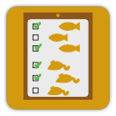
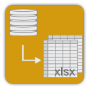

# Animal Base

## About
Animal base is a tool to keep track of the animal population in a
lab. It consists of a mysql database backend to store subject-related
information and a JavaFX-written graphical interface to
view/edit/create entries in the database.

## Development status

The project is under ongoing development and things will
change. Nevertheless, it is in daily use in the lab and the basic
functionality is implemented.

Feel free to try.

## Features

### Manage animals

- Manage animal population in the lab.

### Animal housing

- Track the housing history.

### Manage treatments
 
- Define treaments (experiments/obervations etc.)
- Track treatment history.

### Licenses and permits
- Manage licenses and permits.
- Create quotas.

### Inventory

- Get an population overview.

### Export reports to spreadsheets

- Create exports of stock lists, animal use and per permit or period.

